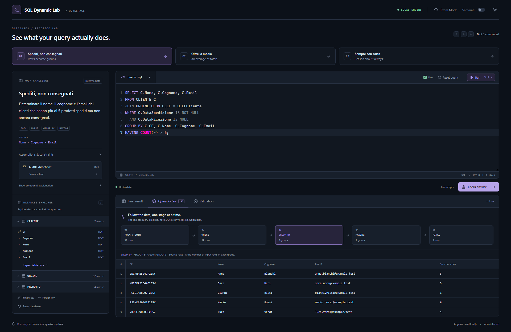

# SQL Dynamic Lab

**See what your query actually does.**

A local-first SQL learning environment for university database exams. Write SQL in Monaco, inspect the underlying tables, trace logical query stages, and validate answers using SQLite running entirely in your browser.

No authentication, backend, Docker, telemetry, LLM, API key, or remote database. Exercise statements use Italian; interface guidance uses English.

## Screenshots



The browser tests also capture 1920px desktop, 1366px laptop, and 390px mobile views in the ignored `artifacts/` directory. Add future screenshots here when the interface changes.

## Start locally

Use **Node.js 22.12+ or 24 LTS** and npm (tested with Node 24.11.1 / npm 11.6.2).

```sh
npm install
npm run dev
```

Open the local URL printed by Vite, normally http://localhost:5173. Internet access is needed for initial dependency installation, not for normal exercise execution. All fonts are system fonts; Monaco, its worker, and SQLite WASM are bundled locally. Keep the local server running while using the application. The app does not yet include a service worker or installable offline shell.

## Commands

| Command                       | Purpose                                                               |
| ----------------------------- | --------------------------------------------------------------------- |
| `npm run dev`                 | Start the local Vite development server                               |
| `npm run build`               | Strict TypeScript checks and production build to `dist/`              |
| `npm run preview`             | Serve the production build locally                                    |
| `npm test`                    | Run deterministic unit/integration tests against real SQLite WASM     |
| `npm run test:watch`          | Watch unit tests while developing                                     |
| `npm run typecheck`           | Check application, configs and tests                                  |
| `npm run lint`                | Run Oxlint                                                            |
| `npm run format`              | Format source and documentation with Prettier                         |
| `npm run format:check`        | Check formatting                                                      |
| `npm run test:e2e`            | Run Chromium browser workflows against Vite                           |
| `npm run test:e2e:production` | Build, then run the same browser tests against the production preview |

Install the browser once before running end-to-end tests:

```sh
npx playwright install chromium
```

Tests start and stop their own local server. The development suite can reuse an existing server at `127.0.0.1:5173`; the production suite uses port 4173. Neither publishes anything.

## Study workflow

1. Select an exercise and read its output columns and assumptions.
2. Inspect tables, primary keys, foreign keys and the seed data in the database explorer.
3. Write a query. Live mode waits **550 ms** after changes. **Ctrl+Enter** (Cmd+Enter on macOS) or **Run** executes immediately.
4. Switch between Final result and Query X-Ray. Incomplete live queries show a quiet writing state; explicit execution reports errors.
5. Select **Check answer** to grade the query. Incorrect answers offer an explicit result-diff reveal; hints progress separately. Full solutions require **Show solution & explanation**.
6. Enable **Exam Mode — Samarati** for independent style guidance.

Drag the lower edge of the editor to resize it. Theme, live mode, current exercise, per-exercise queries, historical solved status, grading attempts and hint usage persist in browser localStorage. Reset query restores the starter. Reset database reconstructs schema and seed data without discarding your query or progress. A previous solved badge remains as historical progress when you later experiment with a different answer; the Validation tab is the verdict for the current answer.

## Features

- Monaco SQL syntax highlighting, line numbers, keyboard execution, error markers and find support.
- Browser-local SQLite WASM in a disposable Web Worker.
- Three university exercises over CLIENTE, PRODOTTO and ORDINE.
- Inspectable schema metadata, row counts and scrollable tables with explicit NULL values.
- Logical row/group transformations and set subtraction in Query X-Ray.
- Result-based grading on **two deterministic, discriminating datasets per exercise**.
- Multiset differences: missing rows, unexpected rows, duplicate counts, output-width and order feedback.
- Progressive hints, explicitly revealed solutions, explanations and alternative strategies.
- Dark/light themes, responsive layouts, keyboard focus indicators and native accessible dialogs.

## Architecture

```text
src/
  engine/                 SQLite lifecycle, guarded execution, worker protocol/client, SQL scanner
  exercises/              Typed exercise definitions, schema and deterministic seed factory
  features/
    editor/               Locally bundled Monaco with SQL language registration
    validation/           Typed multiset normalization and comparison
    query-xray/           Conservative SQL stage derivation
    exam-mode/            Independent deterministic warning rules
  hooks/useLab.ts          UI state, debounce, cancellation and progress orchestration
  components/             Exercise panel, results, explorer grids and dialogs
  lib/persistence.ts      Versioned browser storage with corruption/quota recovery
  styles/                 Theme tokens and responsive layout
  types.ts                Shared domain contracts

tests/core.test.ts         SQLite, grading, adversarial fixtures, X-Ray and lint rules
tests/persistence.test.ts  Local storage robustness
tests/e2e/lab.spec.ts      Actual Monaco + WASM browser workflows and layout checks
```

The main thread sends typed requests to a dedicated worker. SQL, reference execution and X-Ray transformations happen there. A three-second request deadline terminates an unresponsive worker; the next request initializes a fresh database. Initialization gets a separate 15-second deadline. Query edits cancel an in-flight computation and stale responses are ignored.

SQLite databases are read-only after schema/seed initialization (`PRAGMA query_only`). Only one SELECT or WITH statement is accepted. Results are bounded by **1,000 rows, 20,000 cells and 2 MiB**; SQL text is limited to 64,000 characters. SQLite's allocator is capped at 32 MiB. Truncated results cannot pass grading. These are small educational databases, not an arbitrary workload sandbox or a substitute for operating-system resource isolation.

Monaco 0.56 uses package export paths such as `monaco-editor/editor/editor.api.js` and `monaco-editor/languages/definitions/sql/register.js`. Its editor worker is imported with Vite's `?worker`. sql.js uses `initSqlJs({ locateFile })` with a bundled `?url` WASM asset. The transitive DOMPurify dependency is overridden to 3.4.15 to avoid vulnerabilities in Monaco's pinned version. The editor is loaded as a separate lazy chunk; its size produces Vite's expected large-chunk advisory.

## Exercises and deliberate data

Every ORDINE row represents **one unit of one product**. Dates are ISO `YYYY-MM-DD`; NULL shipment/delivery dates mean the event has not occurred. Product price is used as purchase price; historical price changes are outside this schema.

| Exercise                | Key semantics                                                         | Counterexamples in seed data                                                                                                  |
| ----------------------- | --------------------------------------------------------------------- | ----------------------------------------------------------------------------------------------------------------------------- |
| Spediti, non consegnati | More than five shipped, undelivered products                          | Mario: six; Anna: exactly five; Luca: eight shipped, four delivered; Sara: seven orders, four unshipped; Paolo: all delivered |
| Oltre la media          | Customer totals in 2025 above the average of active customers' totals | Unequal order counts and prices; orders in 2024 and 2026; customers without 2025 purchases                                    |
| Sempre con carta        | At least one order and no non-card payments                           | Card-only, mixed methods, only non-card, and a customer with no orders                                                        |

The second fixture changes customer identities, the five/six boundary, product prices, and a payment method. This catches hardcoded visible answers and common accidental matches. Seed generation uses no randomness.

The average in exercise 2 includes only customers with at least one purchase in 2025. Both nested SELECT and CTE solutions are stored. Exercise 3 excludes the customer without orders explicitly; payment methods are NOT NULL, so a three-valued-logic ambiguity is avoided.

## Semantic validation philosophy

Student SQL is never compared with reference SQL text. On each fresh fixture, SQLite executes both queries and the validator compares **typed cell values by column position**, including duplicate multiplicities. Aliases may differ. Row order is ignored unless `orderMatters` is true. NULL, the text `"null"`, a number and its text representation remain distinct. SQLite numeric values arrive as JavaScript numbers; exact numeric comparison is intentional for these exercises.

Column names are not used to infer meaning: exercises explicitly state the requested output order. Extra/missing columns fail even when both results contain zero rows. The UI shows the fixture on which a mismatch occurred, and reveals missing/unexpected values only after an explicit action. Finite fixtures provide strong evidence, not a proof of equivalence across every possible database. A reference query and discrimination tests are required when adding an exercise.

## Query X-Ray

X-Ray explains the **logical** pipeline, not SQLite's optimizer or physical execution order:

```text
FROM / JOIN -> WHERE -> GROUP BY -> HAVING -> FINAL
source rows    rows      groups      groups    projection
```

A small lexical scanner tracks quoted text, comments and parenthesis depth. The derivation module only rewrites a deliberately supported subset: simple table sources and joins, row filters, simple column-based grouping, and a single outer aggregate comparison in HAVING (including exercise 2's nested average). It displays grouping keys, source-row counts and relevant aggregate values. HAVING displays surviving groups. A two-branch EXCEPT uses Candidates -> Excluded -> Final instead.

The engine executes each derived stage in SQLite. It **declines** unsupported or ambiguous queries instead of inventing intermediate data. CTEs, window functions, UNION/INTERSECT, derived-table sources, positional/expression grouping, projection aliases used in earlier clauses, volatile date/random functions and general HAVING expressions currently fall back to an explanation. These queries can still execute and be graded normally. The canonical solutions for all three bundled exercises have useful X-Ray stages. `deriveXRay` is an independent interface that can later be replaced with a dialect-aware AST implementation.

## Exam Mode — Samarati

This is an educational approximation of course conventions, not an authoritative official grading policy. It warns about lowercase keywords, potentially unnecessary DISTINCT, SELECT 1, GROUP BY review, VIEW-based solutions and WITH on NO CTE exercises. Warnings are amber; semantic failures are red; successful validation is green. Rules are conservative heuristics: DISTINCT and SELECT 1 can be entirely valid, and GROUP BY receives a reminder rather than a false claim of invalidity. Style warnings never turn a correct result into a semantic failure. VIEW statements are also outside the lab's read-only execution scope.

## Add an exercise

1. Add an `Exercise` object in `src/exercises/index.ts`, or export one from a new module and register it in the array.
2. Provide a unique ID, title, subtitle, statement, difficulty, tags and ordered `outputColumns`.
3. Supply `schemaSql`, deterministic `seedSql`, at least one additional `validationSeeds` fixture, starter query and canonical `reference` query.
4. Add assumptions in `rules`, progressive `hints`, an explanation, and optionally `alternative`, `noCte` and `orderMatters`.
5. Test that reference and alternative solutions pass all fixtures, and that plausible incorrect solutions fail. Check X-Ray support or its honest fallback.

The UI renders exercise content from this model. No per-exercise branches are needed in the UI, validator or linter.

### Future schema + question generator

A future generator can produce a draft `Exercise` from schema and a natural-language question, including reference queries, fixtures and named adversarial cases. Keep it outside the execution/grading path. Validate the draft's structure, create each database, enforce foreign keys and resource limits, execute references/alternatives, then run discrimination tests before adding it to the reviewed exercise registry. An LLM could assist drafting, but must never be the authority for grading. The current app has no AI dependency or credentials.

## Verification and MVP limits

Automated tests cover all bundled solutions, required incorrect variants, duplicate-sensitive comparison, row-order behavior, reset, memory/result limits, persistence, exam rules, safe rewriting and unsupported syntax. Browser tests exercise Monaco through keyboard/clipboard input, actual worker/WASM execution, all three correct and incorrect answers, diff reveal, live mode, Ctrl+Enter, hints, theme/progress persistence, CTE warnings, database inspection, timeout recovery and responsive screenshots. They assert no page errors or non-local requests in the complete three-exercise workflow.

Known limits:

- X-Ray deliberately supports a subset; general SQL parsing and CTE tracing remain future work.
- The lab accepts read-only queries. Reset reconstructs the database, but this MVP has no INSERT/UPDATE practice mode.
- Floating-point aggregates use exact JavaScript-number comparisons, not decimal-money arithmetic or tolerance grading.
- Grading is fixture-based, and cannot prove universal query equivalence or infer arbitrary column semantics.
- Local progress belongs to one browser/profile/origin. There is no export/import or synchronization yet.
- No offline installation/PWA shell; serve the app locally rather than opening `index.html` with `file://`.
- Browser automation is tested in Chromium; Firefox/WebKit and broader accessibility audits remain follow-up work.
- Interface uses English and exercise statements use Italian; full localization is not implemented.
